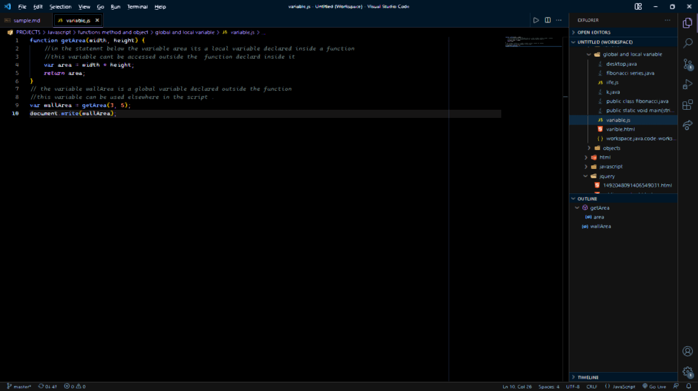
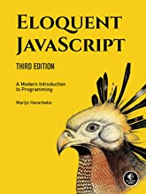
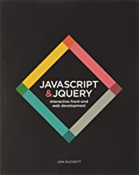
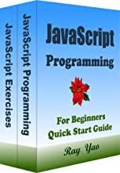

# JavaScript 101:Introduction to modern JavaScript.

>Everything that can be written in JavaScript will be written in JavaScript.
>--<cite>Jon Duckett</cite>

## PAGE CONTENT
* [Introduction](#introduction)
* [Get started with JavaScript](#get-started-with-javascript)
* [Why learn JavaScript?](#why-learn-javascript)
* [Resources.](#resources)

## Introduction.

### What is JavaScript?

JavaScript is Object-Oriented Programming language.
JavaScript was invented by Brendan Eich in 1995.
It is commonly used with web browsers.

<!--image should be here-->

## Get started with JavaScript.

To start learning JavaScript and be able to implend it in web browser,you need to start first buy knowing the basics of JavaScript.

### Basics in JavaScript.

* Arrays
* Variables
* Functions
* Comments
* Data types
* Strings
* Object
* Keywords

## Arrays

Arrays are special variable that can hold more than one value.

`const books = ["java","JavaScript","Python"];`


## Variables

They are two type of varible in JavaScript:

              1.Global variables.
              2.Local variables.

**Global variables**  -They are declared outside the function ,it can be used everywhere.

<!--a code of global variable-->



**Local variables** -They are declared inside the function,used in the current  function

<!--a code  of local variables-->


## Functions

A function is a code block that can repeat to run many times.

` function function-name (){----your code----};`

## Data types.
Variables in JavaScript can hold different type of data type .

Example of data types in JavaScript:

* Numbers
* Strings
* Objects
* Objects

## Comments

Comments are used to explain your code.

Types of Comments in JavaScript:
      

1. Single line comment

` // this is single line comment.`

2. multi line comment.

```js
/*
this is a multi line comment.


*/


```

## Why learn JavaScript?


JavaScript it's a very powerful programming language that you should consider to learn as your programming language.
This are the reasons why you should consider to learn JavaScript.

1. Most popular programming language.
2. JavaScript is versatile.
3. Its in your browser.


## Resources 

Incase you want to start learning JavaScript but you dont know where to begin.Below are some of the books that will help you to master and learn JavaScript.

1. Eloquent JavaScript  *Marign Haverbeke*



2.JavaScript and Jquery *Jon Duckett*



3.JavaScript in 8 hours. *Yao Ray*




